# imbi-api Graph Database Schema

This document describes the Apache AGE (PostgreSQL) graph database nodes
and relationships that `imbi-api` reads from and writes to. Nodes and
edges are populated from `imbi_common.models`, `imbi_api.domain.models`,
and ad-hoc Cypher statements in the endpoint handlers.

The canonical vertex-label registry (with B-tree / unique indexes) lives
in [`imbi-common/src/imbi_common/graph/schemata.toml`][schemata]. Cardinality
in this document refers to how many neighbours a node may hold on the
named relationship — `1` means exactly one, `0..1` zero or one,
`0..*` zero or more, `1..*` one or more.

[schemata]: ../imbi-common/src/imbi_common/graph/schemata.toml

---

## Nodes

### `APIKey`

Programmatic-access credential.

- Python class: `imbi_api.domain.models.APIKey`
- Indexes: `key_id` (unique), `revoked`
- Outgoing relationships:
  - `-[:OWNED_BY]->(:User)` — cardinality `0..1` (key can also be owned
    by a `ServiceAccount`)
  - `-[:OWNED_BY]->(:ServiceAccount)` — cardinality `0..1`

### `Blueprint`

Runtime schema-extension definitions consumed by
`imbi_common.blueprints.get_model()` to dynamically extend Pydantic
models via `pydantic.create_model`.

- Python class: `imbi_common.models.Blueprint`
- Indexes: `(name, type)` unique
- No native edges; assignments are made by other models referencing
  the blueprint by id/slug.

### `ClientCredential`

OAuth2 client credential associated with a service account.

- Python class: `imbi_api.domain.models.ClientCredential`
- Indexes: `client_id` (unique)
- Outgoing relationships:
  - `-[:OWNED_BY]->(:ServiceAccount)` — cardinality `0..1`

### `Conversation`

LLM conversation record. **Read-only from imbi-api**; created by
`imbi-mcp` / `imbi-assistant`. Referenced from user-activity
endpoints (`endpoints/user_activity.py`).

- Indexes: `updated_at`, `user_email`

### `Document`

Free-form, taggable note attached to a `Project`.

- Python class: `imbi_common.models.Document`
- Outgoing relationships:
  - `-[:ATTACHED_TO]->(:Project)` — cardinality `1`
  - `-[:TAGGED_WITH]->(:Tag)` — cardinality `0..*`

### `DocumentTemplate`

Reusable starter content for project `Document`s.

- Python class: `imbi_common.models.DocumentTemplate`
- Indexes: `slug`
- Outgoing relationships:
  - `-[:BELONGS_TO]->(:Organization)` — cardinality `1`
  - `-[:TAGGED_WITH]->(:Tag)` — cardinality `0..*`

### `Environment`

Deployable environment owned by an organization.

- Python class: `imbi_common.models.Environment`
- Outgoing relationships:
  - `-[:BELONGS_TO]->(:Organization)` — cardinality `1`
- Incoming relationships:
  - `(:Project)-[:DEPLOYED_IN]->` — cardinality `0..*`
  - `(:Release)-[:DEPLOYED_TO]->` — cardinality `0..*` (edge carries
    a `deployments: list[DeploymentEvent]` property — see
    `ReleaseDeploymentEdge`)

### `IdentityConnection`

Per-user, per-`Plugin` identity link storing encrypted OAuth tokens
managed by the identity host integration.

- Python class: `imbi_common.models.IdentityConnection`
- Indexes: `(plugin_id, user_id)` unique, `status`, `expires_at`
- Outgoing relationships:
  - `-[:USES_PLUGIN]->(:Plugin)` — cardinality `1`
- Incoming relationships:
  - `(:User)-[:HAS_IDENTITY]->` — cardinality `1`

### `LinkDefinition`

Definition for a per-organization external project link (e.g. GitHub
repo, Grafana dashboard).

- Python class: `imbi_common.models.LinkDefinition`
- Indexes: `slug` (unique)
- Outgoing relationships:
  - `-[:BELONGS_TO]->(:Organization)` — cardinality `1`

### `LocalAuthConfig`

Singleton global toggle for local password authentication.

- Python class: `imbi_api.domain.models.LocalAuthConfig`
- No relationships.

### `Message`

LLM message record. **Read-only from imbi-api**; created by
`imbi-mcp` / `imbi-assistant`.

- Indexes: `conversation_id`

### `OAuthIdentity`

OAuth-provider-issued identity linked to an Imbi `User`.

- Python class: `imbi_api.domain.models.OAuthIdentity`
- Indexes: `email`, `(provider_slug, provider_user_id)` unique
- Outgoing relationships:
  - `-[:OAUTH_IDENTITY]->(:User)` — cardinality `1`

### `Organization`

Top-level tenant.

- Python class: `imbi_common.models.Organization`
- Incoming relationships:
  - `(:Team)-[:BELONGS_TO]->` — cardinality `0..*`
  - `(:Environment)-[:BELONGS_TO]->` — cardinality `0..*`
  - `(:ProjectType)-[:BELONGS_TO]->` — cardinality `0..*`
  - `(:ThirdPartyService)-[:BELONGS_TO]->` — cardinality `0..*`
  - `(:Tag)-[:BELONGS_TO]->` — cardinality `0..*`
  - `(:LinkDefinition)-[:BELONGS_TO]->` — cardinality `0..*`
  - `(:DocumentTemplate)-[:BELONGS_TO]->` — cardinality `0..*`
  - `(:Webhook)-[:BELONGS_TO]->` — cardinality `0..*`
  - `(:User)-[:MEMBER_OF {role}]->` — cardinality `0..*`
    (edge carries `MembershipProperties.role`)
  - `(:ServiceAccount)-[:MEMBER_OF {role}]->` — cardinality `0..*`

### `Permission`

A named resource-action capability.

- Python class: `imbi_api.domain.models.Permission`
- Indexes: `name` (unique), `resource_type`
- Incoming relationships:
  - `(:Role)-[:GRANTS]->` — cardinality `0..*`

### `Plugin`

A loaded plugin instance bound to a `ThirdPartyService`. Stores
runtime `options` and capability flags.

- Python class: `imbi_common.models.Plugin`
- Indexes: `plugin_slug`, `api_version`
- Outgoing relationships:
  - `-[:USES_APPLICATION]->(:ServiceApplication)` — cardinality `0..1`
- Incoming relationships:
  - `(:ThirdPartyService)-[:HAS_PLUGIN]->` — cardinality `1`
  - `(:IdentityConnection)-[:USES_PLUGIN]->` — cardinality `0..*`
  - `(:Project)-[:USES_PLUGIN {tab,default,options,identity_plugin_id,env_payloads}]->` — cardinality `0..*`
  - `(:ProjectType)-[:USES_PLUGIN {tab,default,options,identity_plugin_id,env_payloads}]->` — cardinality `0..*`

### `PluginRegistration`

Per-slug registry row toggling whether a discovered plugin is
enabled. Seeded by `imbi_api.plugins.lifecycle._seed_registrations`.

- Indexes: `slug` (unique)
- No relationships.

### `Project`

A managed service / application.

- Python class: `imbi_common.models.Project`
- Indexes: `name`, `slug`
- Outgoing relationships:
  - `-[:OWNED_BY]->(:Team)` — cardinality `1`
  - `-[:TYPE]->(:ProjectType)` — cardinality `0..*`
  - `-[:DEPLOYED_IN]->(:Environment)` — cardinality `0..*`
  - `-[:HAS_RELEASE]->(:Release)` — cardinality `0..*`
  - `-[:DEPENDS_ON]->(:Project)` — cardinality `0..*`
  - `-[:EXISTS_IN {identifier, canonical_link}]->(:ThirdPartyService)` — cardinality `0..*`
  - `-[:USES_PLUGIN {…}]->(:Plugin)` — cardinality `0..*` (project-level
    plugin overrides)
- Incoming relationships:
  - `(:Document)-[:ATTACHED_TO]->` — cardinality `0..*`
  - `(:Project)-[:DEPENDS_ON]->` — cardinality `0..*` (inverse)

### `ProjectType`

Classification (e.g. service, library) within an organization.

- Python class: `imbi_common.models.ProjectType`
- Outgoing relationships:
  - `-[:BELONGS_TO]->(:Organization)` — cardinality `1`
  - `-[:USES_PLUGIN {…}]->(:Plugin)` — cardinality `0..*` (project-type-
    level plugin defaults)
- Incoming relationships:
  - `(:Project)-[:TYPE]->` — cardinality `0..*`
  - `(:ScoringPolicy)-[:TARGETS]->` — cardinality `0..*`

### `Release`

A versioned release of a `Project`.

- Python class: `imbi_common.models.Release`
- Indexes: `version` (per-project uniqueness enforced in application)
- Outgoing relationships:
  - `-[:DEPLOYED_TO]->(:Environment)` — cardinality `0..*`
    (edge: `ReleaseDeploymentEdge.deployments: list[DeploymentEvent]`)
- Incoming relationships:
  - `(:Project)-[:HAS_RELEASE]->` — cardinality `1`

### `Role`

Group of permissions; can inherit from another role.

- Python class: `imbi_api.domain.models.Role`
- Indexes: `slug` (unique), `priority`
- Outgoing relationships:
  - `-[:GRANTS]->(:Permission)` — cardinality `0..*`
  - `-[:INHERITS_FROM]->(:Role)` — cardinality `0..1`

### `ScoringPolicy`

Scoring rule applied to a set of project types.

- Indexes: `slug` (unique), `(category, enabled)`, `attribute_name`
- Outgoing relationships:
  - `-[:TARGETS]->(:ProjectType)` — cardinality `0..*` (created
    on-demand by the scoring engine — no Pydantic Edge metadata)

### `ServiceAccount`

Machine-to-machine principal.

- Python class: `imbi_api.domain.models.ServiceAccount`
- Indexes: `slug` (unique)
- Outgoing relationships:
  - `-[:MEMBER_OF {role}]->(:Organization)` — cardinality `0..*`
- Incoming relationships:
  - `(:ClientCredential)-[:OWNED_BY]->` — cardinality `0..*`
  - `(:APIKey)-[:OWNED_BY]->` — cardinality `0..*`
  - `(:TokenMetadata)-[:ISSUED_TO]->` — cardinality `0..*`

### `ServiceApplication`

Registered application for a `ThirdPartyService` (e.g. an OAuth client
or webhook signing key). Stores encrypted per-credential token strings.

- Python class: `imbi_common.models.ServiceApplication`
- Indexes: `slug`, `status`
- Outgoing relationships:
  - `-[:REGISTERED_IN]->(:ThirdPartyService)` — cardinality `1`
- Incoming relationships:
  - `(:Plugin)-[:USES_APPLICATION]->` — cardinality `0..*`

### `Session`

Active user session.

- Python class: `imbi_api.domain.models.Session`
- Indexes: `session_id` (unique), `expires_at`
- Outgoing relationships:
  - `-[:SESSION_FOR]->(:User)` — cardinality `1`

### `TOTPSecret`

Encrypted multi-factor authentication secret.

- Python class: `imbi_api.domain.models.TOTPSecret`
- Outgoing relationships:
  - `-[:MFA_FOR]->(:User)` — cardinality `1`

### `Tag`

Per-organization label applied to `Document`s and `DocumentTemplate`s.

- Python class: `imbi_common.models.Tag`
- Outgoing relationships:
  - `-[:BELONGS_TO]->(:Organization)` — cardinality `1`
- Incoming relationships:
  - `(:Document)-[:TAGGED_WITH]->` — cardinality `0..*`
  - `(:DocumentTemplate)-[:TAGGED_WITH]->` — cardinality `0..*`

### `Team`

Sub-org grouping that owns projects.

- Python class: `imbi_common.models.Team`
- Indexes: `slug` (unique)
- Outgoing relationships:
  - `-[:BELONGS_TO]->(:Organization)` — cardinality `1`
- Incoming relationships:
  - `(:Project)-[:OWNED_BY]->` — cardinality `0..*`
  - `(:User)-[:MEMBER_OF]->` — cardinality `0..*`
    (Team membership; carries no role property)
  - `(:ThirdPartyService)-[:MANAGED_BY]->` — cardinality `0..*`

### `ThirdPartyService`

External SaaS / managed-service (Stripe, Datadog, …).

- Python classes: `imbi_common.models.ThirdPartyService` and
  `imbi_api.domain.models.ThirdPartyService` (API-side superset with
  vendor / status / URLs / identifiers)
- Indexes: `slug` (unique), `status`
- Outgoing relationships:
  - `-[:BELONGS_TO]->(:Organization)` — cardinality `1`
  - `-[:MANAGED_BY]->(:Team)` — cardinality `0..1`
  - `-[:HAS_PLUGIN]->(:Plugin)` — cardinality `0..*`
- Incoming relationships:
  - `(:ServiceApplication)-[:REGISTERED_IN]->` — cardinality `0..*`
  - `(:Project)-[:EXISTS_IN {…}]->` — cardinality `0..*`
  - `(:Webhook)-[:IMPLEMENTED_BY {…}]->` — cardinality `0..*`

### `TokenMetadata`

Metadata for a JWT (jti, family, expiry, revocation) — keeps refresh
tokens revocable without storing the token itself.

- Python class: `imbi_api.domain.models.TokenMetadata`
- Indexes: `jti` (unique)
- Outgoing relationships:
  - `-[:ISSUED_TO]->(:User)` — cardinality `0..1`
  - `-[:ISSUED_TO]->(:ServiceAccount)` — cardinality `0..1`

### `Upload`

S3 upload metadata (key, content-type, optional thumbnail).

- Python class: `imbi_api.domain.models.Upload`
- No relationships.

### `User`

Authenticatable person.

- Python class: `imbi_api.domain.models.User`
- Indexes: `email` (unique), `is_active`
- Outgoing relationships:
  - `-[:MEMBER_OF {role}]->(:Organization)` — cardinality `0..*`
    (edge: `MembershipProperties`)
  - `-[:MEMBER_OF]->(:Team)` — cardinality `0..*`
  - `-[:HAS_IDENTITY]->(:IdentityConnection)` — cardinality `0..*`
  - `-[:CAN_ACCESS {actions, granted_at, granted_by}]->(:* /any resource node)` — cardinality `0..*`
    (edge: `ResourcePermission`; resource label resolved dynamically)
- Incoming relationships:
  - `(:OAuthIdentity)-[:OAUTH_IDENTITY]->` — cardinality `0..*`
  - `(:Session)-[:SESSION_FOR]->` — cardinality `0..*`
  - `(:TOTPSecret)-[:MFA_FOR]->` — cardinality `0..1`
  - `(:APIKey)-[:OWNED_BY]->` — cardinality `0..*`
  - `(:TokenMetadata)-[:ISSUED_TO]->` — cardinality `0..*`

### `Webhook`

Inbound HTTP webhook owned by an organization.

- Indexes: `slug` (unique), `id` (unique)
- Outgoing relationships:
  - `-[:BELONGS_TO]->(:Organization)` — cardinality `1`
  - `-[:IMPLEMENTED_BY {identifier_selector, user_subject_selector, identity_plugin_slug, event_type_selector}]->(:ThirdPartyService)` — cardinality `0..1`
- Incoming relationships:
  - `(:WebhookRule)-[:ACTIONS]->` — cardinality `0..*`

### `WebhookImplementation`

Declared in `schemata.toml`'s vlabel list but **not materialised as a
node by imbi-api**. The connection between a `Webhook` and its
`ThirdPartyService` is the edge `[:IMPLEMENTED_BY]` (which carries
the implementation properties directly).

### `WebhookRule`

A single ordered rule (filter expression + handler + config) attached
to a `Webhook`.

- Outgoing relationships:
  - `-[:ACTIONS]->(:Webhook)` — cardinality `1`

---

## Relationships (edge labels)

The following table summarises every relationship type imbi-api reads
or writes, and the endpoint(s) that source the cardinality. Edges
declared with `imbi_common.models.Edge` metadata on Pydantic fields
are persisted via `imbi_common.graph.Graph.create()` / `.merge()`;
others are created with hand-written Cypher.

| Edge | From → To | Source | Edge properties |
| --- | --- | --- | --- |
| `:ACTIONS` | `WebhookRule` → `Webhook` | `endpoints/webhooks.py` | none (rule ordinal lives on the source node) |
| `:ATTACHED_TO` | `Document` → `Project` | `models.Document.project` | none |
| `:BELONGS_TO` | `Team` → `Organization` | `models.Team.organization` | none |
| `:BELONGS_TO` | `Environment` → `Organization` | `models.Environment.organization` | none |
| `:BELONGS_TO` | `ProjectType` → `Organization` | `models.ProjectType.organization` | none |
| `:BELONGS_TO` | `ThirdPartyService` → `Organization` | `domain.models.ThirdPartyService.organization` | none |
| `:BELONGS_TO` | `Tag` → `Organization` | `endpoints/tags.py` | none |
| `:BELONGS_TO` | `LinkDefinition` → `Organization` | `models.LinkDefinition.organization` | none |
| `:BELONGS_TO` | `DocumentTemplate` → `Organization` | `models.DocumentTemplate.organization` | none |
| `:BELONGS_TO` | `Webhook` → `Organization` | `endpoints/webhooks.py` | none |
| `:CAN_ACCESS` | `User` → (any resource node) | `auth/permissions.py` | `ResourcePermission` (`actions`, `granted_at`, `granted_by`) |
| `:DEPENDS_ON` | `Project` → `Project` | `endpoints/projects.py` | none |
| `:DEPLOYED_IN` | `Project` → `Environment` | `models.Project.environments` | none |
| `:DEPLOYED_TO` | `Release` → `Environment` | `models.Release.environments` | `ReleaseDeploymentEdge.deployments: list[DeploymentEvent]` |
| `:EXISTS_IN` | `Project` → `ThirdPartyService` | `endpoints/webhooks.py` (project-services router) | `identifier`, `canonical_link` |
| `:GRANTS` | `Role` → `Permission` | `auth/seed.py`, `domain.models.Role.permissions` | none |
| `:HAS_IDENTITY` | `User` → `IdentityConnection` | `identity/repository.py` | none |
| `:HAS_PLUGIN` | `ThirdPartyService` → `Plugin` | `models.Plugin.service` (incoming) | none |
| `:HAS_RELEASE` | `Project` → `Release` | `models.Release.project` (incoming), `endpoints/releases.py` | none |
| `:IMPLEMENTED_BY` | `Webhook` → `ThirdPartyService` | `endpoints/webhooks.py` | `identifier_selector`, `user_subject_selector`, `identity_plugin_slug`, `event_type_selector` |
| `:INHERITS_FROM` | `Role` → `Role` | `domain.models.Role.parent_role` | none |
| `:ISSUED_TO` | `TokenMetadata` → `User`/`ServiceAccount` | `auth/tokens.py`, `domain.models.TokenMetadata.user` | none |
| `:MANAGED_BY` | `ThirdPartyService` → `Team` | `domain.models.ThirdPartyService.team` | none |
| `:MEMBER_OF` | `User` → `Organization` | `domain.models.User.organizations` (`OrganizationEdge`) | `MembershipProperties.role` (Role slug) |
| `:MEMBER_OF` | `ServiceAccount` → `Organization` | `domain.models.ServiceAccount.organizations` | `MembershipProperties.role` |
| `:MEMBER_OF` | `User` → `Team` | `endpoints/teams.py` | none |
| `:MFA_FOR` | `TOTPSecret` → `User` | `domain.models.TOTPSecret.user` | none |
| `:OAUTH_IDENTITY` | `OAuthIdentity` → `User` | `domain.models.OAuthIdentity.user`, `endpoints/auth.py` | none |
| `:OWNED_BY` | `Project` → `Team` | `models.Project.team` | none |
| `:OWNED_BY` | `APIKey` → `User`/`ServiceAccount` | `domain.models.APIKey.user`, `endpoints/sa_api_keys.py` | none |
| `:OWNED_BY` | `ClientCredential` → `ServiceAccount` | `domain.models.ClientCredential.service_account` | none |
| `:REGISTERED_IN` | `ServiceApplication` → `ThirdPartyService` | `endpoints/auth_providers.py`, `endpoints/service_plugins.py` | none |
| `:SESSION_FOR` | `Session` → `User` | `domain.models.Session.user` | none |
| `:TAGGED_WITH` | `Document` → `Tag` | `models.Document.tags` | none |
| `:TAGGED_WITH` | `DocumentTemplate` → `Tag` | `models.DocumentTemplate.tags` | none |
| `:TARGETS` | `ScoringPolicy` → `ProjectType` | `endpoints/scoring_policies.py` | none |
| `:TYPE` | `Project` → `ProjectType` | `models.Project.project_types` | none |
| `:USES_APPLICATION` | `Plugin` → `ServiceApplication` | `models.Plugin.service_application` | none |
| `:USES_PLUGIN` | `IdentityConnection` → `Plugin` | `identity/repository.py` | none |
| `:USES_PLUGIN` | `Project` → `Plugin` | `endpoints/project_plugins.py` | `tab`, `default`, `options`, `identity_plugin_id`, `env_payloads` (JSON-encoded) |
| `:USES_PLUGIN` | `ProjectType` → `Plugin` | `endpoints/project_type_plugins.py` | same as above |

### Edge-property model classes

| Edge | Pydantic model |
| --- | --- |
| `User -[:MEMBER_OF]-> Organization`, `ServiceAccount -[:MEMBER_OF]-> Organization` | `imbi_api.domain.models.MembershipProperties` (carried via `OrganizationEdge` named tuple) |
| `Release -[:DEPLOYED_TO]-> Environment` | `imbi_common.models.ReleaseDeploymentEdge` wrapping `list[DeploymentEvent]` |
| `User -[:CAN_ACCESS]-> *` | `imbi_api.domain.models.ResourcePermission` |
| simple edges with no payload | `imbi_api.domain.models.EmptyRelationship` |
| (base class for blueprint-extended dynamic edges) | `imbi_common.models.RelationshipEdge` |

---

## Notes & caveats

- **Schemata vs. runtime labels.** `schemata.toml` lists the vertex
  labels that get indexed and pre-registered with AGE. AGE will accept
  un-listed labels (`Document`, `Tag`, `LocalAuthConfig`) at runtime
  via plain Cypher `CREATE`; those labels just don't have application-
  managed indexes.
- **`WebhookImplementation` is unused as a node** even though it's
  declared in `schemata.toml`. The metadata it would carry is stored
  on the `:IMPLEMENTED_BY` edge instead. Consider pruning it from the
  vlabel registry.
- **`Conversation` / `Message`** are populated by `imbi-mcp` /
  `imbi-assistant`; imbi-api only reads them for the user-activity
  endpoints.
- **`CAN_ACCESS` resource targets** are not strongly typed — the
  permission check in `auth/permissions.py` matches the destination
  by `labels(resource)` against a runtime `resource_type` string, so
  the edge can land on any node label that exposes `slug`.
- **`Plugin -[:USES_PLUGIN]->` edge properties** include JSON-encoded
  `options` and `env_payloads`; AGE's edge property store can't hold
  nested maps, so the API encodes/decodes them at the boundary
  (`plugins/assignments.py`).
- **`Project -[:USES_PLUGIN]-> Plugin` vs. `ProjectType -[:USES_PLUGIN]-> Plugin`.**
  Both use the same edge label but differ in the source label; the
  resolution layer (`plugins/resolution.py`) merges them, with the
  project-level edge taking precedence over the project-type default.

---

## ER diagram

Cardinality is shown on the outgoing (target) side only — the source
side is rendered as `||` ("this single node") because we are reading
"how many of the target does one source have?". `UK` marks unique
indexes; non-unique indexes are tagged with the `"indexed"` comment.
Composite indexes share a marker across their member attributes.

```mermaid
erDiagram
    APIKey {
        string key_id UK
        boolean revoked "indexed"
    }
    Blueprint {
        string name UK "composite with type"
        string type UK "composite with name"
    }
    ClientCredential {
        string client_id UK
    }
    Conversation {
        string user_email "indexed"
        datetime updated_at "indexed"
    }
    Document {
    }
    DocumentTemplate {
        string slug "indexed"
    }
    Environment {
    }
    IdentityConnection {
        string plugin_id UK "composite with user_id"
        string user_id UK "composite with plugin_id"
        string status "indexed"
        datetime expires_at "indexed"
    }
    LinkDefinition {
        string slug UK
    }
    LocalAuthConfig {
    }
    Message {
        string conversation_id "indexed"
    }
    OAuthIdentity {
        string email "indexed"
        string provider_slug UK "composite with provider_user_id"
        string provider_user_id UK "composite with provider_slug"
    }
    Organization {
    }
    Permission {
        string name UK
        string resource_type "indexed"
    }
    Plugin {
        string plugin_slug "indexed"
        int api_version "indexed"
    }
    PluginRegistration {
        string slug UK
    }
    Project {
        string name "indexed"
        string slug "indexed"
    }
    ProjectType {
    }
    Release {
        string version "indexed"
    }
    Role {
        string slug UK
        int priority "indexed"
    }
    ScoringPolicy {
        string slug UK
        string category "indexed composite with enabled"
        boolean enabled "indexed composite with category"
        string attribute_name "indexed"
    }
    ServiceAccount {
        string slug UK
    }
    ServiceApplication {
        string slug "indexed"
        string status "indexed"
    }
    Session {
        string session_id UK
        datetime expires_at "indexed"
    }
    Tag {
    }
    Team {
        string slug UK
    }
    ThirdPartyService {
        string slug UK
        string status "indexed"
    }
    TokenMetadata {
        string jti UK
    }
    TOTPSecret {
    }
    Upload {
    }
    User {
        string email UK
        boolean is_active "indexed"
    }
    Webhook {
        string id UK
        string slug UK
    }
    WebhookRule {
    }

    APIKey            ||--o| User              : "OWNED_BY (0..1)"
    APIKey            ||--o| ServiceAccount    : "OWNED_BY (0..1)"
    ClientCredential  ||--o| ServiceAccount    : "OWNED_BY (0..1)"
    Document          ||--||  Project          : "ATTACHED_TO (1)"
    Document          ||--o{  Tag              : "TAGGED_WITH (0..*)"
    DocumentTemplate  ||--||  Organization     : "BELONGS_TO (1)"
    DocumentTemplate  ||--o{  Tag              : "TAGGED_WITH (0..*)"
    Environment       ||--||  Organization     : "BELONGS_TO (1)"
    IdentityConnection ||--|| Plugin           : "USES_PLUGIN (1)"
    LinkDefinition    ||--||  Organization     : "BELONGS_TO (1)"
    OAuthIdentity     ||--||  User             : "OAUTH_IDENTITY (1)"
    Plugin            ||--o|  ServiceApplication : "USES_APPLICATION (0..1)"
    Project           ||--||  Team             : "OWNED_BY (1)"
    Project           ||--o{  ProjectType      : "TYPE (0..*)"
    Project           ||--o{  Environment      : "DEPLOYED_IN (0..*)"
    Project           ||--o{  Release          : "HAS_RELEASE (0..*)"
    Project           ||--o{  Project          : "DEPENDS_ON (0..*)"
    Project           ||--o{  ThirdPartyService : "EXISTS_IN (0..*)"
    Project           ||--o{  Plugin           : "USES_PLUGIN (0..*)"
    ProjectType       ||--||  Organization     : "BELONGS_TO (1)"
    ProjectType       ||--o{  Plugin           : "USES_PLUGIN (0..*)"
    Release           ||--o{  Environment      : "DEPLOYED_TO (0..*)"
    Role              ||--o{  Permission       : "GRANTS (0..*)"
    Role              ||--o|  Role             : "INHERITS_FROM (0..1)"
    ScoringPolicy     ||--o{  ProjectType      : "TARGETS (0..*)"
    ServiceAccount    ||--o{  Organization     : "MEMBER_OF (0..*)"
    ServiceApplication ||--|| ThirdPartyService : "REGISTERED_IN (1)"
    Session           ||--||  User             : "SESSION_FOR (1)"
    Tag               ||--||  Organization     : "BELONGS_TO (1)"
    Team              ||--||  Organization     : "BELONGS_TO (1)"
    ThirdPartyService ||--||  Organization     : "BELONGS_TO (1)"
    ThirdPartyService ||--o|  Team             : "MANAGED_BY (0..1)"
    ThirdPartyService ||--o{  Plugin           : "HAS_PLUGIN (0..*)"
    TokenMetadata     ||--o|  User             : "ISSUED_TO (0..1)"
    TokenMetadata     ||--o|  ServiceAccount   : "ISSUED_TO (0..1)"
    TOTPSecret        ||--||  User             : "MFA_FOR (1)"
    User              ||--o{  Organization     : "MEMBER_OF (0..*)"
    User              ||--o{  Team             : "MEMBER_OF (0..*)"
    User              ||--o{  IdentityConnection : "HAS_IDENTITY (0..*)"
    Webhook           ||--||  Organization     : "BELONGS_TO (1)"
    Webhook           ||--o|  ThirdPartyService : "IMPLEMENTED_BY (0..1)"
    WebhookRule       ||--||  Webhook          : "ACTIONS (1)"
```

> The `User -[:CAN_ACCESS]-> *` edge is omitted because its target
> label is resolved dynamically at query time (`labels(resource)`) and
> doesn't bind to a single node type. `Blueprint` and `PluginRegistration`
> have no outgoing edges. `Conversation` / `Message` are sourced from
> sibling services (`imbi-mcp` / `imbi-assistant`) and imbi-api only
> reads them — they appear here for the schema's sake, with no
> outgoing edges from imbi-api's perspective.
